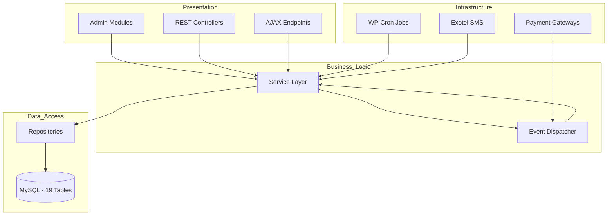
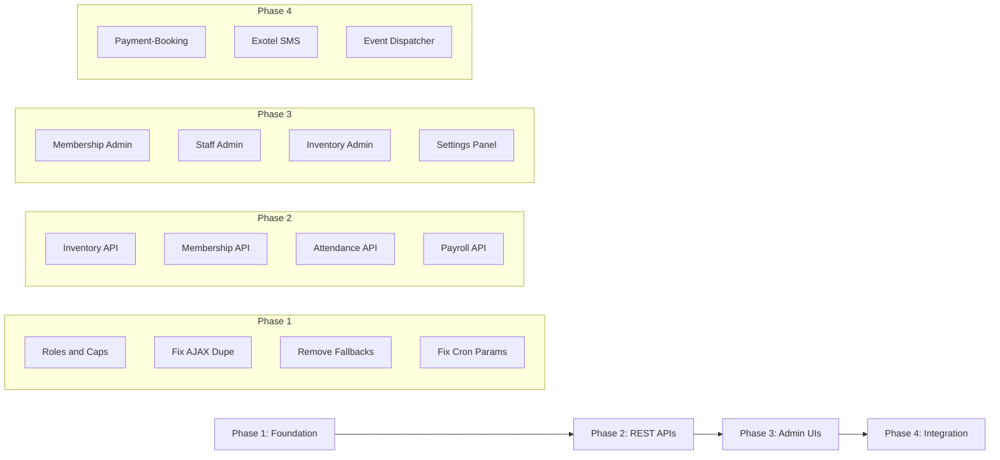

# GlamLux2Lux — Feature Activation & Role Responsibility Plan

## Executive Summary

After a complete audit of all 90+ PHP files in the `glamlux-core` plugin, I identified **15 features** that are either dummy/stub, partially wired, or completely inactive. The plugin has a solid architectural foundation (19 DB tables, 5 custom roles, Domain-Driven Design layers) but many features exist only as code files with no functional connection to the platform.

This plan activates every feature end-to-end: Admin UI → REST API → Service Layer → Repository → Database.

---

## Architecture Overview

---

## Current State: Feature Activation Matrix

| # | Feature | Admin UI | REST API | Service | Repository | DB Table | Status |
|---|---------|----------|----------|---------|------------|----------|--------|
| 1 | **Booking/Appointments** | ✅ Full | ✅ Full | ✅ Full | ✅ Full | `gl_appointments` | ✅ Active |
| 2 | **CRM/Lead Management** | ✅ Full | ✅ Full | ✅ Full | ✅ Full | `gl_leads`, `gl_followups` | ✅ Active |
| 3 | **Staff Management** | ❌ Stub | ✅ Full | ✅ Full | ✅ Full | `gl_staff` | ⚠️ Partial |
| 4 | **Membership Tiers** | ❌ Stub | ❌ None | ✅ Full | ✅ Full | `gl_memberships`, `gl_membership_purchases` | ⚠️ Partial |
| 5 | **Inventory** | ❌ None | ❌ None | ⚠️ Minimal | ✅ Full | `gl_inventory` | ⚠️ Partial |
| 6 | **Attendance/Shifts** | ❌ None | ❌ None | ✅ Full | ✅ Full | `gl_attendance`, `gl_shifts` | ⚠️ Partial |
| 7 | **Payroll** | ✅ Full | ❌ None | ✅ Full | ✅ Full | `gl_payroll` | ⚠️ Partial |
| 8 | **Revenue Reporting** | ✅ Full | ✅ Full | ✅ Full | ✅ Full | `gl_financial_reports` | ✅ Active |
| 9 | **Franchise CRUD** | ✅ Full | ❌ None | ❌ None | ✅ Full | `gl_franchises` | ⚠️ Partial |
| 10 | **Salon CRUD** | ✅ Full | ⚠️ Hardcoded fallback | ❌ None | ✅ Full | `gl_salons` | ⚠️ Partial |
| 11 | **Service Catalogue** | ✅ Full | ⚠️ Hardcoded fallback | ❌ None | ✅ Full | `gl_service_pricing` | ⚠️ Partial |
| 12 | **Payment/Razorpay** | ❌ No settings UI | ✅ Webhook only | ✅ Full | ✅ Full | — | ⚠️ Partial |
| 13 | **SMS/Notifications** | ❌ None | ❌ None | ❌ Mock only | — | — | ❌ Dummy |
| 14 | **GDPR Compliance** | ❌ None | ✅ Full | ✅ Full | ✅ Full | — | ✅ Active |
| 15 | **Operations Health** | ✅ Dashboard | ✅ Full | ✅ Full | ✅ Full | — | ✅ Active |

---

## Role & Capability Architecture

### Current Roles Defined in Activator

| Role | Slug | Key Capabilities | Status |
|------|------|-----------------|--------|
| **Super Admin** | `glamlux_super_admin` | `manage_glamlux_platform`, full WP editorial | ✅ Active |
| **Franchise Admin** | `glamlux_franchise_admin` | `manage_glamlux_franchise`, own-salon editorial | ✅ Active |
| **Staff** | `glamlux_staff` | `manage_glamlux_appointments`, `upload_files` | ⚠️ Missing attendance caps |
| **Client** | `glamlux_client` | `book_appointments` | ⚠️ Missing membership caps |
| **State Manager** | `glamlux_state_manager` | `view_state_reports`, `manage_glamlux_franchise` | ⚠️ Missing territory caps |
| **Salon Manager** | — | Referenced in `require_salon_manager()` but never created as a role | ❌ Missing role |

### What Each Role SHOULD Be Able To Do

| Action | Super Admin | Franchise Admin | Salon Manager | Staff | Client | State Manager |
|--------|:-----------:|:---------------:|:-------------:|:-----:|:------:|:-------------:|
| Manage all franchises | ✅ | ❌ | ❌ | ❌ | ❌ | ❌ |
| Manage own franchise salons | ✅ | ✅ | ❌ | ❌ | ❌ | ❌ |
| Manage salon staff | ✅ | ✅ | ✅ | ❌ | ❌ | ❌ |
| View/manage appointments | ✅ | ✅ | ✅ | ✅ own | ❌ | ❌ |
| Check in/out attendance | ✅ | ✅ | ✅ | ✅ own | ❌ | ❌ |
| View payroll | ✅ | ✅ | ✅ | ✅ own | ❌ | ❌ |
| Manage inventory | ✅ | ✅ | ✅ | ❌ | ❌ | ❌ |
| Manage memberships tiers | ✅ | ✅ | ❌ | ❌ | ❌ | ❌ |
| Book appointment | ✅ | ✅ | ✅ | ✅ | ✅ | ❌ |
| View own membership | ❌ | ❌ | ❌ | ❌ | ✅ | ❌ |
| View territory reports | ✅ | ❌ | ❌ | ❌ | ❌ | ✅ |
| Manage leads/CRM | ✅ | ✅ | ❌ | ❌ | ❌ | ✅ |
| View global reports | ✅ | ❌ | ❌ | ❌ | ❌ | ✅ |
| Configure settings | ✅ | ❌ | ❌ | ❌ | ❌ | ❌ |

---

## Activation Plan — Feature by Feature

### FEATURE 1: Memberships Admin Module

**Current:** [`class-glamlux-memberships.php`](wp-content/plugins/glamlux-core/admin/modules/class-glamlux-memberships.php) — 10-line stub returning `true`
**Service Layer:** [`class-glamlux-service-membership.php`](wp-content/plugins/glamlux-core/services/class-glamlux-service-membership.php) — FULLY implemented with grant/revoke/renew/WC hooks
**Fix Required:**

- Rewrite `GlamLux_Memberships` admin module with full CRUD UI: list tiers, add/edit tier form, view members, grant/revoke
- Wire to existing `GlamLux_Service_Membership` for all data operations
- Admin page already registered at `glamlux-memberships` and `glamlux-my-memberships`

### FEATURE 2: Staff Admin Module

**Current:** [`class-glamlux-staff.php`](wp-content/plugins/glamlux-core/admin/modules/class-glamlux-staff.php) — Static HTML placeholder
**Service Layer:** [`class-glamlux-service-staff.php`](wp-content/plugins/glamlux-core/services/class-glamlux-service-staff.php) — FULLY implemented CRUD
**Fix Required:**

- Rewrite `render_admin_page()` to fetch real staff data via `GlamLux_Service_Staff`
- Add create/edit form for staff members
- Wire commission rate editing, salon assignment, deactivation toggle

### FEATURE 3: Exotel SMS Integration

**Current:** [`class-glamlux-exotel-api.php`](wp-content/plugins/glamlux-core/includes/class-glamlux-exotel-api.php) — Mock only, logs to error_log
**Fix Required:**

- Implement actual `wp_remote_post()` call to Exotel SMS API
- Add settings fields for Exotel credentials in Settings panel
- Wire SMS notifications into event system: booking confirmation, membership granted, lead captured

### FEATURE 4: Remove Hardcoded Fallback Data

**Current:** [`class-salon-controller.php`](wp-content/plugins/glamlux-core/Rest/class-salon-controller.php:22) and [`class-service-controller.php`](wp-content/plugins/glamlux-core/Rest/class-service-controller.php:22) return fake data when DB is empty
**Fix Required:**

- Remove hardcoded arrays — return empty arrays when no data exists
- This ensures the API reflects real database state

### FEATURE 5: Inventory REST API

**Current:** Repository exists fully but no REST controller, no admin UI
**Fix Required:**

- Create `GlamLux_Inventory_Controller` with endpoints: `GET /inventory`, `POST /inventory`, `PUT /inventory/{id}/restock`, `PUT /inventory/{id}/deduct`
- Expand `GlamLux_Service_Inventory` with full CRUD methods
- Register controller in `GlamLux_REST_Manager`

### FEATURE 6: Membership REST API

**Current:** Service layer is complete but no REST controller
**Fix Required:**

- Create `GlamLux_Membership_Controller` with endpoints: `GET /memberships/tiers`, `POST /memberships/tiers`, `PUT /memberships/tiers/{id}`, `POST /memberships/grant`, `POST /memberships/revoke`
- Register controller in `GlamLux_REST_Manager`

### FEATURE 7: Attendance REST API

**Current:** Service layer has check-in/check-out/summary but no REST exposure
**Fix Required:**

- Create `GlamLux_Attendance_Controller` with endpoints: `POST /attendance/check-in`, `POST /attendance/check-out`, `GET /attendance/summary`
- Register controller in `GlamLux_REST_Manager`

### FEATURE 8: Payroll REST API

**Current:** Service and admin UI exist but no REST API
**Fix Required:**

- Create `GlamLux_Payroll_Controller` with endpoints: `GET /payroll`, `POST /payroll/run`, `PUT /payroll/{id}/mark-paid`, `GET /payroll/liability`
- Register controller in `GlamLux_REST_Manager`

### FEATURE 9: Payment-Booking Integration

**Current:** Payment service creates Razorpay orders but booking flow does not trigger payment
**Fix Required:**

- Add `POST /glamlux/v1/payments/create-order` REST endpoint that takes `appointment_id`, creates Razorpay order, returns `order_id` + `key_id` for frontend checkout
- Add `POST /glamlux/v1/payments/verify` for frontend verification after Razorpay checkout
- Wire `GlamLux_Service_Payment` into the bootstrap with `$event_dispatcher` injection

### FEATURE 10: Settings Panel Completion

**Current:** [`class-glamlux-settings.php`](wp-content/plugins/glamlux-core/admin/class-glamlux-settings.php) only has hero/about fields
**Fix Required:**

- Add Payment Settings section: Razorpay Key ID, Key Secret, Webhook Secret
- Add SMS Settings section: Exotel Key, Token, Subdomain, SID
- Add Business Settings: Default commission rate, default appointment duration, timezone

### FEATURE 11: Fix Duplicate AJAX Hooks

**Current:** Both [`GlamLux_Appointments`](wp-content/plugins/glamlux-core/admin/modules/class-glamlux-appointments.php:20) and [`GlamLux_AJAX`](wp-content/plugins/glamlux-core/includes/class-glamlux-ajax.php:13) register `glamlux_book_appointment` and `glamlux_check_availability`
**Fix Required:**

- Remove AJAX registrations from `GlamLux_Appointments` — keep them in `GlamLux_AJAX` which follows the clean delegation pattern
- Update `GlamLux_Appointments` to be admin-display only

### FEATURE 12: Event Dispatcher Activation

**Current:** [`class-event-dispatcher.php`](wp-content/plugins/glamlux-core/Core/class-event-dispatcher.php) only maps 2 events: `appointment_completed` and `payment_completed`
**Fix Required:**

- Add event listeners for: `appointment_created` -> SMS notification + inventory check, `lead_captured` -> SMS notification, `membership_granted` -> SMS notification, `payment_captured` -> mark appointment paid, `low_inventory_alert` -> email notification to salon manager
- Wire listeners in `register_core_listeners()`

### FEATURE 13: Inventory Admin Module

**Current:** No admin page for inventory management
**Fix Required:**

- Create `GlamLux_Inventory_Admin` class with WP admin page
- List inventory by salon, add product, restock, set reorder thresholds
- Register under Franchise Admin menu and Super Admin menu

### FEATURE 14: Fix Cron Payroll Parameters

**Current:** [`GlamLux_Cron::run_payroll()`](wp-content/plugins/glamlux-core/includes/class-glamlux-cron.php:241) calls `$service->run_monthly_batch()` without date parameters
**Service Signature:** `run_monthly_batch($ps, $pe, $sid = 0)` requires period_start and period_end
**Fix Required:**

- Calculate current month start/end dates in `run_payroll()` and pass them
- Also fix the admin-triggered payroll run to pass correct dates

### FEATURE 15: Complete Role Capabilities

**Current:** Missing `glamlux_salon_manager` role; `glamlux_client` missing `view_membership` cap; `glamlux_staff` missing `glamlux_check_attendance`
**Fix Required:**

- Add `glamlux_salon_manager` role in activator with: `manage_glamlux_salon`, `view_salon_reports`, `manage_glamlux_appointments`
- Add capability `glamlux_check_attendance` to staff role
- Add capability `view_glamlux_membership` to client role
- Add capability `glamlux_manage_territory` to state manager role
- Add capability `glamlux_manage_inventory` to franchise admin and salon manager

---

## Implementation Order

### Phase 1 — Foundation Fixes

Quick structural fixes that prevent bugs and enable later phases.

### Phase 2 — REST API Controllers

Build the missing REST endpoints so both the Admin UI and any future frontend/mobile app can consume them.

### Phase 3 — Admin UI Activation

Replace stubs with real WP admin pages wired to the service layer.

### Phase 4 — Cross-Feature Integration

Wire payment into bookings, SMS into events, and complete the event bus.

---

## Files Modified Per Feature

| Feature | Files to Create | Files to Modify |
|---------|----------------|-----------------|
| F1 Memberships Admin | — | `admin/modules/class-glamlux-memberships.php` |
| F2 Staff Admin | — | `admin/modules/class-glamlux-staff.php` |
| F3 Exotel SMS | — | `includes/class-glamlux-exotel-api.php` |
| F4 Remove Fallbacks | — | `Rest/class-salon-controller.php`, `Rest/class-service-controller.php` |
| F5 Inventory API | `Rest/class-inventory-controller.php` | `services/class-glamlux-service-inventory.php`, `Rest/class-rest-manager.php`, `glamlux-core.php` |
| F6 Membership API | `Rest/class-membership-controller.php` | `Rest/class-rest-manager.php`, `glamlux-core.php` |
| F7 Attendance API | `Rest/class-attendance-controller.php` | `Rest/class-rest-manager.php`, `glamlux-core.php` |
| F8 Payroll API | `Rest/class-payroll-controller.php` | `Rest/class-rest-manager.php`, `glamlux-core.php` |
| F9 Payment Integration | — | `Rest/class-booking-controller.php`, `glamlux-core.php` |
| F10 Settings | — | `admin/class-glamlux-settings.php` |
| F11 Fix AJAX | — | `admin/modules/class-glamlux-appointments.php` |
| F12 Event Dispatcher | — | `Core/class-event-dispatcher.php` |
| F13 Inventory Admin | `admin/modules/class-glamlux-inventory.php` | `admin/class-glamlux-admin.php`, `glamlux-core.php` |
| F14 Fix Cron | — | `includes/class-glamlux-cron.php`, `admin/modules/class-glamlux-payroll.php` |
| F15 Roles | — | `Core/class-activator.php` |

**New files: 5** | **Modified files: ~20**
