# GlamLux2Lux Workspace Audit Report & Cleanup Plan

## Executive Summary

This audit examined the entire workspace for unnecessary files, dead code, security issues, and structural problems. The project is a WordPress-based salon franchise management system deployed on Railway. The codebase shows signs of **code-generation-driven development** — many files were written by PHP generator scripts rather than by hand, leaving behind significant scaffolding debris.

---

## 🔴 CRITICAL: Security Issues

### 1. Hardcoded Database Password in Git

- **File:** [`wp-config-railway.php`](wp-config-railway.php:7)
- **Line 7:** `define('DB_PASSWORD', getenv('MYSQLPASSWORD') ?: 'NsDeFKtbxzhdOczkobJdDUAKVvhGrdlk');`
- **Risk:** Plaintext password committed to version control
- **Fix:** Remove hardcoded fallback; fail gracefully if env var is missing

### 2. Weak Salt Fallbacks

- **File:** [`wp-config-railway.php`](wp-config-railway.php:12) lines 12-19
- **Risk:** Predictable salts like `gl-auth-key-1` weaken auth tokens
- **Fix:** Generate unique random fallbacks or require env vars

### 3. Default Admin Credentials in Install Script

- **File:** [`install.sh`](install.sh:28) line 28
- **Content:** `--admin_password="admin123"`
- **Fix:** Prompt for password or use env var

### 4. Browser-Triggered Seeder Still Active

- **File:** [`glamlux-core.php`](wp-content/plugins/glamlux-core/glamlux-core.php:243) lines 243-258
- **Risk:** `?seed_now=1` query param triggers DB seeding on every `init` hook check
- **Fix:** Remove after seeding is complete, or move to WP-CLI only

---

## 🟡 Files to Delete — Temporary & Scaffolding Debris

### Top-Level Temporary Files

| File | Size | Reason |
|------|------|--------|
| [`temp-seed-runner.php`](temp-seed-runner.php) | 293B | One-time seed runner, fakes `WP_CLI` — temporary file |
| [`tmp-plugins.html`](tmp-plugins.html) | 65KB | Saved HTML page from WP admin — no purpose in repo |
| [`setup-pages-menus.php`](setup-pages-menus.php) | 3.8KB | Duplicate of [`scripts/setup-pages-menus.php`](wp-content/plugins/glamlux-core/scripts/setup-pages-menus.php) |

### Code Generator Scripts — Already Executed, No Runtime Use

These scripts use `file_put_contents()` to generate actual source files. They are **build artifacts** that should not ship in production:

| File | Size | Purpose |
|------|------|---------|
| [`scripts/scaffold-rest.php`](wp-content/plugins/glamlux-core/scripts/scaffold-rest.php) | 10.9KB | Generated all `Rest/class-*-controller.php` files |
| [`scripts/write-content-manager.php`](wp-content/plugins/glamlux-core/scripts/write-content-manager.php) | 29.2KB | Generated `class-glamlux-content-manager.php` |
| [`scripts/refactor-phase2-group1.php`](wp-content/plugins/glamlux-core/scripts/refactor-phase2-group1.php) | 11.3KB | Generated repositories and services — Group 1 |
| [`scripts/refactor-phase2-group2.php`](wp-content/plugins/glamlux-core/scripts/refactor-phase2-group2.php) | 18.6KB | Generated repositories and services — Group 2 |
| [`scripts/glamlux_phase7_gen.php`](wp-content/plugins/glamlux-core/scripts/glamlux_phase7_gen.php) | 20.9KB | Generated event dispatcher, attendance, webhook, commission, revenue, payroll, membership services |

**Total recoverable:** ~91KB of dead generator code

### Seed Scripts — Dev-Only, Should Not Ship to Production

| File | Size |
|------|------|
| [`scripts/seed-enterprise-visual-dataset.php`](wp-content/plugins/glamlux-core/scripts/seed-enterprise-visual-dataset.php) | 21.4KB |
| [`scripts/seed-visual-dataset-39.php`](wp-content/plugins/glamlux-core/scripts/seed-visual-dataset-39.php) | 12.9KB |
| [`scripts/wp-cli-seeder.php`](wp-content/plugins/glamlux-core/scripts/wp-cli-seeder.php) | 15.5KB |

---

## 🟡 Empty / Zero-Byte Files

These files exist but contain **zero bytes** — they are either stubs that were never implemented, or placeholders:

| File | Impact |
|------|--------|
| [`repositories/class-glamlux-repo-staff.php`](wp-content/plugins/glamlux-core/repositories/class-glamlux-repo-staff.php) | **Loaded by `glamlux-core.php:146`** — will cause fatal error if any code depends on the class |
| [`services/class-glamlux-service-staff.php`](wp-content/plugins/glamlux-core/services/class-glamlux-service-staff.php) | **Loaded by `glamlux-core.php:176`** — same fatal error risk |
| [`wp-content/object-cache.php`](wp-content/object-cache.php) | Empty drop-in — Redis cache will never work. Either install Redis Object Cache plugin properly or remove |
| [`themes/glamlux-theme/archive.php`](wp-content/themes/glamlux-theme/archive.php) | Empty template — WordPress falls back to `index.php`, so this is harmless but pointless |
| [`themes/glamlux-theme/single.php`](wp-content/themes/glamlux-theme/single.php) | Empty template — same as above |
| [`events/`](wp-content/plugins/glamlux-core/events/) | Empty directory with no files |

---

## 🟡 Duplicate Files

| Original | Duplicate |
|----------|-----------|
| [`wp-content/plugins/glamlux-core/scripts/setup-pages-menus.php`](wp-content/plugins/glamlux-core/scripts/setup-pages-menus.php) | [`setup-pages-menus.php`](setup-pages-menus.php) — root copy |
| [`scripts/test-domain.php`](scripts/test-domain.php) | [`wp-content/plugins/glamlux-core/test-domain.php`](wp-content/plugins/glamlux-core/test-domain.php) — near-identical copy |

---

## 🟡 Unnecessary Bundled Plugins

| File/Directory | Reason |
|----------------|--------|
| [`wp-content/plugins/hello.php`](wp-content/plugins/hello.php) | Hello Dolly — ships with WordPress, zero utility |
| [`wp-content/plugins/akismet/`](wp-content/plugins/akismet/) | Akismet spam filter — not relevant for a salon management API; if not used, remove |

---

## 🟡 Stub / Placeholder Code Blocks

### `class-glamlux-memberships.php` — Dead Admin Module

- **File:** [`class-glamlux-memberships.php`](wp-content/plugins/glamlux-core/admin/modules/class-glamlux-memberships.php)
- Contains a single stub method `grant_membership()` that returns `true` and does nothing
- The real logic lives in [`class-glamlux-service-membership.php`](wp-content/plugins/glamlux-core/services/class-glamlux-service-membership.php)

### `class-glamlux-exotel-api.php` — Mock-Only Integration

- **File:** [`class-glamlux-exotel-api.php`](wp-content/plugins/glamlux-core/includes/class-glamlux-exotel-api.php)
- `send_sms()` has no actual cURL logic — just logs and returns `true`
- Comment says _"Actual cURL logic would go here"_

### `class-glamlux-staff.php` — Static HTML Placeholder

- **File:** [`admin/modules/class-glamlux-staff.php`](wp-content/plugins/glamlux-core/admin/modules/class-glamlux-staff.php)
- `render_admin_page()` outputs hardcoded HTML with _"No staff members found"_
- No data fetching, no `WP_List_Table` integration

---

## 🟡 Two Dockerfiles with Different Purposes

| File | Base Image | Used By |
|------|------------|---------|
| [`Dockerfile`](Dockerfile) | `wordpress:apache` | Railway production |
| [`wp/Dockerfile`](wp/Dockerfile) | `wordpress:php8.2-fpm` | Local `docker-compose.yml` |

This is intentional but could be confusing. Consider documenting which is for what.

---

## 🔵 Structural Improvements

### 1. Case-Sensitive Directory Names

The plugin has mixed casing: `Core/`, `Rest/`, `repositories/`, `services/`, `admin/`, `includes/`. On Linux servers, this works but is fragile. Standardize to lowercase.

### 2. No Autoloader

The bootstrap in [`glamlux-core.php`](wp-content/plugins/glamlux-core/glamlux-core.php:105) manually `require_once`s 40+ files. A PSR-4 or WordPress-convention autoloader would eliminate this fragile dependency chain.

### 3. Global Variables as DI

Lines 204-206 in [`glamlux-core.php`](wp-content/plugins/glamlux-core/glamlux-core.php:204) use `global` variables for service injection. This is an anti-pattern — consider a simple service container.

### 4. Vendored JS Libraries Without Version Pinning

- [`assets/js/gsap.min.js`](wp-content/themes/glamlux-theme/assets/js/gsap.min.js) — 71KB
- [`assets/js/ScrollTrigger.min.js`](wp-content/themes/glamlux-theme/assets/js/ScrollTrigger.min.js) — 42KB
- [`assets/js/lenis.min.js`](wp-content/themes/glamlux-theme/assets/js/lenis.min.js) — 10KB

These are vendored without version info. Consider loading from CDN or adding version comments.

---

## Cleanup Action Plan

### Phase 1: Delete Unnecessary Files

- [ ] Delete [`temp-seed-runner.php`](temp-seed-runner.php)
- [ ] Delete [`tmp-plugins.html`](tmp-plugins.html)
- [ ] Delete root [`setup-pages-menus.php`](setup-pages-menus.php) — keep the one inside plugin scripts
- [ ] Delete [`wp-content/plugins/hello.php`](wp-content/plugins/hello.php)
- [ ] Delete [`wp-content/plugins/glamlux-core/test-domain.php`](wp-content/plugins/glamlux-core/test-domain.php)
- [ ] Delete [`scripts/test-domain.php`](scripts/test-domain.php)

### Phase 2: Move Generator Scripts to Archive

- [ ] Move all 5 generator scripts from `scripts/` to a `scripts/_archived/` folder or delete them
- [ ] Move seed scripts to `scripts/_dev-only/` or exclude from Docker build

### Phase 3: Fix Empty Files

- [ ] Implement [`class-glamlux-repo-staff.php`](wp-content/plugins/glamlux-core/repositories/class-glamlux-repo-staff.php) with at minimum an empty class shell
- [ ] Implement [`class-glamlux-service-staff.php`](wp-content/plugins/glamlux-core/services/class-glamlux-service-staff.php) with at minimum an empty class shell
- [ ] Remove empty [`archive.php`](wp-content/themes/glamlux-theme/archive.php) and [`single.php`](wp-content/themes/glamlux-theme/single.php) or implement them
- [ ] Either properly set up [`object-cache.php`](wp-content/object-cache.php) or remove the empty file
- [ ] Remove empty [`events/`](wp-content/plugins/glamlux-core/events/) directory

### Phase 4: Security Fixes

- [ ] Remove hardcoded DB password fallback from [`wp-config-railway.php`](wp-config-railway.php:7)
- [ ] Replace weak salt fallbacks with proper random strings
- [ ] Remove `?seed_now=1` init hook from [`glamlux-core.php`](wp-content/plugins/glamlux-core/glamlux-core.php:243)
- [ ] Change default admin password in [`install.sh`](install.sh:28)

### Phase 5: Code Quality

- [ ] Delete or complete stub in [`class-glamlux-memberships.php`](wp-content/plugins/glamlux-core/admin/modules/class-glamlux-memberships.php)
- [ ] Delete or complete stub in [`class-glamlux-staff.php`](wp-content/plugins/glamlux-core/admin/modules/class-glamlux-staff.php)
- [ ] Implement actual Exotel API call or clearly mark as mock in [`class-glamlux-exotel-api.php`](wp-content/plugins/glamlux-core/includes/class-glamlux-exotel-api.php)
- [ ] Add class autoloader to replace 40+ manual `require_once` calls
- [ ] Replace global variable DI with a service container pattern

### Phase 6: Evaluate Third-Party Plugins

- [ ] Decide whether Akismet is needed — if not, remove the entire `akismet/` directory
- [ ] Document why two Dockerfiles exist in the README

---

## File Audit Diagram

```mermaid
graph TD
    A[Workspace Root] --> B[DELETE: temp files]
    A --> C[KEEP: Config + Infra]
    A --> D[glamlux-core plugin]
    
    B --> B1[temp-seed-runner.php]
    B --> B2[tmp-plugins.html]
    B --> B3[setup-pages-menus.php - duplicate]
    
    D --> E[DELETE: Generator scripts]
    D --> F[FIX: Empty files]
    D --> G[FIX: Stub code]
    D --> H[KEEP: Production code]
    
    E --> E1[scaffold-rest.php]
    E --> E2[write-content-manager.php]
    E --> E3[refactor-phase2-group1.php]
    E --> E4[refactor-phase2-group2.php]
    E --> E5[glamlux_phase7_gen.php]
    
    F --> F1[class-glamlux-repo-staff.php - 0 bytes]
    F --> F2[class-glamlux-service-staff.php - 0 bytes]
    F --> F3[object-cache.php - 0 bytes]
    F --> F4[archive.php - 0 bytes]
    F --> F5[single.php - 0 bytes]
    
    G --> G1[class-glamlux-memberships.php - stub]
    G --> G2[class-glamlux-exotel-api.php - mock only]
    G --> G3[class-glamlux-staff.php - static HTML]

    style B fill:#ff6b6b
    style E fill:#ff6b6b
    style F fill:#ffd93d
    style G fill:#ffd93d
    style H fill:#6bcb77
```

